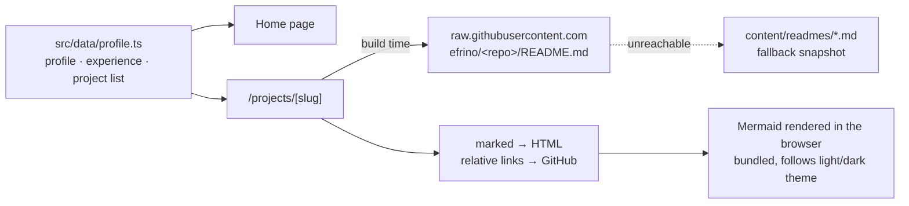

# efrinowep: Portfolio of Efrino Wahyu Eko Pambudi

Personal portfolio site built with [Astro](https://astro.build) and deployed on **Vercel**.

The project case studies are **not written twice**. At build time, each page fetches the README of the matching GitHub repository and renders it, including Mermaid diagrams. Updating a project's README and redeploying updates the portfolio.

## How it works



| Path | Purpose |
|---|---|
| `src/data/profile.ts` | All non-README content: intro, experience, education, skills and the project list (order = order on the home page) |
| `src/lib/readme.ts` | Fetches a README (with a snapshot fallback), strips the badge header and author footer, rewrites relative links to GitHub, and renders Markdown |
| `src/pages/index.astro` | Home: hero, about, experience, flagship (PPIC Smart Planner), projects, private work, skills, contact |
| `src/pages/projects/[slug].astro` | One case-study page per project, rendered from its README |
| `content/readmes/` | Fallback copies of the READMEs, used only if GitHub is unreachable during a build |
| `public/` | Resume PDF, PPIC screenshots and favicon |

## Development

```bash
npm install
npm run dev       # http://localhost:4321
npm run build     # static output in dist/
npm run preview   # serve the build
npm run snapshot  # refresh content/readmes/ from GitHub
```

## Deploying to Vercel

1. In Vercel, choose **Add New → Project** and import `efrino/efrinowep`.
2. Vercel detects **Astro** automatically (build `npm run build`, output `dist`). No environment variables are needed.
3. Every push to `main` redeploys. To pick up README changes from other repos, click **Redeploy** or add a Deploy Hook and call it after updating a README.

## Adding a project

Add an entry to `projects` in `src/data/profile.ts` with the repo name, then run `npm run snapshot` to save its fallback copy.
