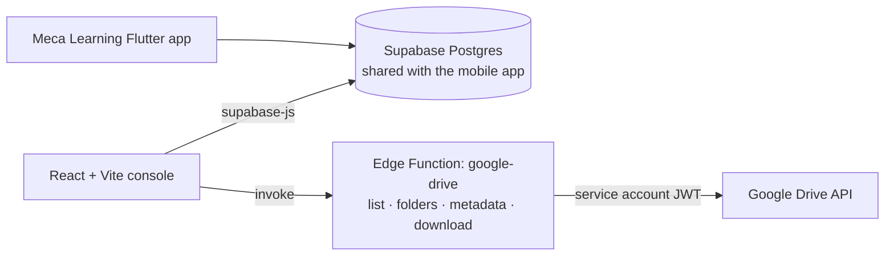

<div align="center">

# 🧑‍💼 Meca Admin Console

**Web admin console for the Meca Learning app: manage users, training content, quizzes and error codes, and monitor learner activity.**


</div>

---

## Overview

The [Meca Learning](https://github.com/efrino/meca_learning_app) mobile app gives mechanics training modules, reference sheets, quizzes, error codes and animations. This console is where the training team **manages that content and tracks learning activity**, without touching the database directly.

It shares the same Supabase backend as the mobile app, and reaches the Google Drive content library through a **Supabase Edge Function**, so Google credentials never reach the browser.

## Features

| Tab | What admins can do |
|---|---|
| **Dashboard stats** | Headline numbers for users, content and activity |
| **Users** | Create, edit and deactivate mechanic accounts (employee number, role, active flag) |
| **Modules** and **Meca Sheet** | Manage training modules and reference sheets linked to Google Drive files |
| **Meca Aid** | Organise the reference library folders shown in the app |
| **Quizzes** | Build quizzes and certification questions (multiple choice or essay), or **bulk-import them from an Excel template** |
| **Error Codes** | Maintain machine error codes (cause, symptom, solution, severity, machine type), including **bulk import from Excel** |
| **Animations** | Manage the training video catalogue |
| **Activities** | Browse learner activity logs (logins, navigation, study sessions) captured by the app |

## Architecture



- **Excel import pipeline**: `src/utils/excelQuizParser.js` and `excelErrorCodeParser.js` validate spreadsheet rows against a fixed template before inserting, with a CSV fallback in `excelUtils.js`.
- **Drive proxy**: `supabase/functions/google-drive` signs a service-account JWT (Deno + `djwt`) and exposes `list`, `folders`, `metadata` and `download` actions. The credentials come from function secrets.
- **Session handling**: passwords are hashed client-side before comparison, and sessions expire automatically (`src/utils/auth.js`, `src/hooks/useAuth.js`).

## Project Structure

```
src/
  components/   Header, Login, StatsCards and one component per tab
                (Users, Modules, MecaSheet, MecaAid, Quizzes, ErrorCodes, Animations, Activities)
  config/       supabase client
  hooks/        useAuth
  utils/        auth, excelUtils, excelQuizParser, excelErrorCodeParser, googleDrive
supabase/
  functions/google-drive/   Edge Function proxy to the Google Drive API
```

## Getting Started

```bash
npm install
```

Create `.env`:

```env
VITE_SUPABASE_URL=...
VITE_SUPABASE_ANON_KEY=...
```

Deploy the Drive proxy with its secrets:

```bash
supabase secrets set GOOGLE_CLIENT_EMAIL=... GOOGLE_PRIVATE_KEY="..."
supabase functions deploy google-drive
```

Run it:

```bash
npm run dev       # local development
npm run lint      # ESLint
npm run build     # production build
```

## Related

- [**meca_learning_app**](https://github.com/efrino/meca_learning_app): the Flutter app this console manages

## Author

**Efrino Wahyu Eko Pambudi**: [GitHub](https://github.com/efrino) · [LinkedIn](https://www.linkedin.com/in/efrinowep/) · [Portfolio](https://efrino.netlify.app)
